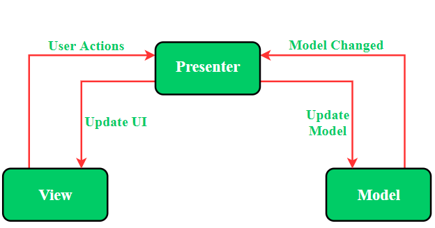
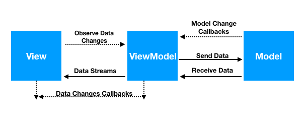
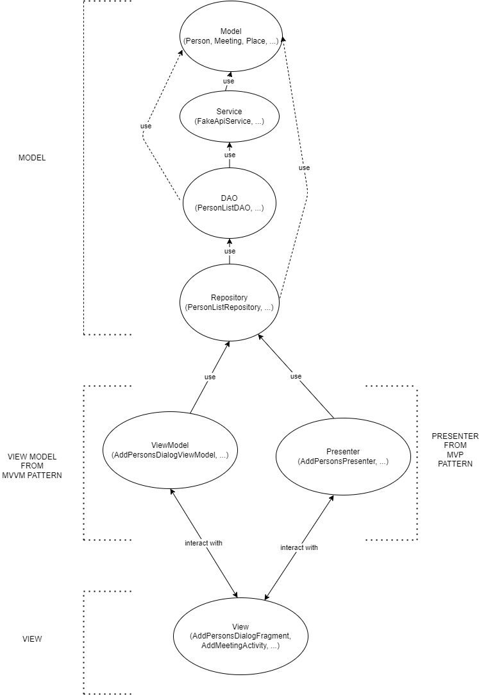

# MVP/MVVM Project

## Description

This is a project to demonstrate the use of the MVP and MVVM patterns in Android.


## Step by step creation

1. Create a new project in Android Studio (do not check "use legacy android support library")
2. Create a new package "model" and design the associated classes (example : *Meeting*, *Person*, *Place*). A *Meeting* must at least contain *a subject*, *a date*, *a place*, and *a list of persons invited* to the meeting. A *Person* must at least includes *an email*. A *Place* must at least includes *a name*.
3. Create a new package "service". Add an interface *MeetingsApiService* with at least three methods : `List<Meeting> getMeetings()`, `void addMeeting(Meeting meeting)`, and `void deleteMeeting(Meeting meeting)`. Create an implementation class of that interface, that you named *DummyMeetingsApiService* for example.
4. Create a new package "utils". Add an utils class `DateEasy` that allows to convert a `String` to an `Instant` and vice versa (take into account the TimeZone, and the formatting). Add a `PersonsListFormatter` class that allows to convert a `List<Person>` to a `String`, formatted enough to be displayed.
5. Create a new package "di", and create the associated singleton `DI` class, that allows to get the instance of the `MeetingsApiService` everywhere in the app source code.
6. Create `DateEasyUnitTest`, and `MeetingsApiServiceUnitTest` classes, and write unit tests for the methods of the `DateEasy` and `MeetingsApiService` classes. Ensure every tests successfully pass.
7. Create a new subpackage "ui", in the "utils" package. Add a `SimpleTextWatcher` class that implements `TextWatcher`, and override not used methods `beforeTextChanged` and `onTextChanged`. Add a `SimpleTextWatcherFactory`, that allows to switch the icons of an TextInputLayout, depending if the text entered is empty (or not).
8. Create a new package "ui". Create the subpackage "pickers", that will allows the user to pick a date or a time (at meeting registration). Create a subsubpackage "date", and add a `DatePickerContract` interface which specify contract between presenter (fragment) and view, and between presenter and model. Create a subsubpackage "time", and do the same in order to create a time picker with MVP design in mind.
9. Create the subfolder "res/anim", and put `slide_down.xml` and `slide_up.xml` files in it.
10. Create the subfolder "res/menu", and create a simple menu for "add meeting" dialog, and "add persons" dialog.
11. Create the subfolder "res/layout", and create the following layout files : `activity_main.xml` (a constraint layout, simply containing an floating action button to add a meeting), `fragment_meeting_list.xml` (which contains at least a card view for the filters by date or place, and the recycler view for displaying the list), `fragment_meetings_list_item.xml` (used by the view holder to render a single meeting, so with its place, date, persons invited, and drop button), `fragment_meeting_registration.xml` (create a form with place, date, subject, in order to add a meeting. do not forget a link to allow to open an other dialog to add persons in that meeting), `fragment_add_people_dialog.xml` (a form with a single input to add the person email).
12. Create the subfolder "res/values", and create the initial following files : `colors.xml`, `dimens.xml`, `strings.xml`, and `styles.xml`.
13. Create the subpackage "add_persons", in the package "ui". Create the `AddPersonsDialogContract` interface, that specify the contract between presenter (fragment) and view, and between presenter and model. Create the `AddPersonsDialogPresenter` class, that implements the `AddPersonsDialogContract.Presenter` interface. Create the `AddPersonsDialogFragment` class, that implements the `AddPersonsDialogContract.View` interface. Do the same with the model, and create a factory to ease the creation of that UI.
14. Create the subpackage "meetings_registration", in the package "ui", and do the same logic as the previous item.
15. Create the subpackage "meetings_list", in the package "ui", and do the same logic as the previous item.
16. Create a `MeetingsListTest` in order to write instrumented tests for the `MeetingsListFragment` class. Ensure every tests successfully pass.

## Reasons to use Java for Android app

Students may ask some advantages over Kotlin to stick with Java :

- It's a very popular language (large community)
- It's a mature language (lots of libraries, and tools)
- It's easy to learn
- It's easy to find resources
- It's easy to find jobs (and not only with Android)
- It's easy to find developers
- It's easy to find meetups
- Frequent updates
- Core language of the SDK

## Demo Activity

We can add a demo activity in order to simplify some UI components demo : 

```java
package ... .mareu.ui.main;

import androidx.appcompat.app.AppCompatActivity;
import androidx.fragment.app.FragmentManager;

import android.os.Bundle;
import android.widget.Button;

import ... .mareu.R;
import java.util.Set;
import java.util.TreeSet;

import butterknife.BindView;
import butterknife.ButterKnife;
import ... .mareu.di.DI;
import ... .mareu.model.Meeting;
import ... .mareu.model.Person;
import ... .mareu.ui.meetings_registration.MeetingRegistrationDialogFactory;
import ... .mareu.ui.meetings_registration.MeetingRegistrationDialogFragment;
import ... .mareu.ui.add_persons.AddPersonsDialogFactory;
import ... .mareu.ui.add_persons.AddPersonsDialogFragment;
import ... .mareu.ui.meetings_list.MeetingsListFragment;
import ... .mareu.ui.meetings_list.MeetingsListModel;
import ... .mareu.ui.meetings_list.MeetingsListPresenter;
import ... .mareu.ui.pickers.date.DatePickerFactory;
import ... .mareu.ui.pickers.date.DatePickerFragment;
import ... .mareu.ui.pickers.time.TimePickerFactory;
import ... .mareu.ui.pickers.time.TimePickerFragment;
import ... .mareu.utils.DateEasy;

public class MainActivity extends AppCompatActivity {
    @BindView(R.id.button)
    Button button;
    @BindView(R.id.button2)
    Button button2;
    @BindView(R.id.button3)
    Button button3;
    @BindView(R.id.button4)
    Button button4;
    @BindView(R.id.button5)
    Button button5;

    @Override
    protected void onCreate(Bundle savedInstanceState) {
        super.onCreate(savedInstanceState);
        setContentView(R.layout.activity_main);
        ButterKnife.bind(this);
        final FragmentManager fm = getSupportFragmentManager();
        
        // button 1 : open a dialog to pick a date
        button.setOnClickListener(v -> {
            // create the date picker factory
            DatePickerFactory factory = new DatePickerFactory();
            // get the fragment ..
            DatePickerFragment fragment = factory.getFragment(
                    DateEasy.now(),
                    null,
                    !false,
                    // on date set, notify the presenter
                    (datePicked) -> System.out.println("Date has been chosen : " + datePicked)
            );
            // .. and display it
            fragment.display(fm);
        });
        
        // button 2 : open a dialog to pick a time
        button2.setOnClickListener(v -> {
            // create the time picker factory
            TimePickerFactory factory = new TimePickerFactory();
            // create the fragment
            TimePickerFragment fragment = factory.getFragment(
                    DateEasy.now(),
                    (timePicked) -> System.out.println("Time has been picked out : " + timePicked)
            );
            // .. and display it
            fragment.display(fm);
        });
        
        // button 3 : open a dialog to add persons in a meeting
        button3.setOnClickListener(v -> {
            // add initial persons to the meeting 
            Set<Person> persons = new TreeSet<>();
            persons.add(new Person("user1@gmail.com"));
            persons.add(new Person("user2@gmail.com"));
            // create the meeting registration dialog factory
            AddPersonsDialogFactory factory = new AddPersonsDialogFactory();
            // create the fragment as a displayable object
            AddPersonsDialogDisplayable fragment = factory.getFragment(
                    persons,
                    (personsSet) -> personsSet.stream().map(x -> x.getEmail()).forEach(System.out::println),
                    "MVP" // MVP or MVVM
            );
            // .. and display it
            fragment.display(fm);
        });
        
        // button 4 : open a form dialog to add a meeting
        button4.setOnClickListener(v -> {
            // create the meeting registration dialog factory
            MeetingRegistrationDialogFactory factory = new MeetingRegistrationDialogFactory();
            // create the fragment
            MeetingRegistrationDialogFragment fragment = factory.getFragment();
            // .. and display it
            fragment.display(fm);
        });
        
        // button 5 : open a list of meetings
        button5.setOnClickListener(v -> {
            // create the fragment for the meetings list
            ListMeetingsFragment f = ListMeetingsFragment.newInstance();
            // create the model for the meetings list
            ListMeetingsModel m = new ListMeetingsModel();
            // create the presenter for the meetings list
            ListMeetingsPresenter p = new ListMeetingsPresenter(f, m);
            // display the fragment
            fm
                .beginTransaction()
                .add(R.id.activity_meetings, f)
                .commit();
        });
        
    }

    public void updateMeetingsFragments() {
        DI.getMeetingsApiService().getMeetings().stream().map(x -> x.getSubject()).forEach(System.out::println);
    }

}
```

## Layout used

### ConstraintLayout

### FrameLayout

FrameLayout is designed to block out an area on the screen to display a single item. You can position and size the item anywhere within the FrameLayout area by assigning layout_width, layout_height, layout_gravity, and layout_margin attributes. The item can also be stretched, centered, or tiled within the FrameLayout area.

By default, if you add multiple children to a `FrameLayout`, they would overlap each other. A `FrameLayout` should be used most often to hold at most a single child view.

### CoordinatorLayout

The main appeal of the `CoordinatorLayout` is its ability to coordinate the animations and transitions of the views within it. There are no overlap between its children.

`CoordinatorLayout` is intended for two primary use cases:

- as a top-level application decor or chrome layout
- as a container for a specific interaction with one or more child views

### RelativeLayout

The `RelativeLayout` is a layout that positions its children relative to each other. It is a good choice when you want to position a child view relative to another sibling view.

## MVP vs MVVM

### Issues with MVC

Using MVC as software architecture, developers face the following difficulties:

- Most of the main business logic resides in the Controller. Over the life of an application, this file grows and it becomes difficult to maintain the code.
- Due to tightly coupled user interface and data access mechanisms, the Controller and View layers belong to the same activity or fragment. This poses a problem for making changes to the application's functionality.
- It becomes difficult to perform unit tests on different layers as most of the tested parts require Android SDK components.

### MVP



The reason why MVP is widely accepted is because it offers modularity, testability, and a cleaner and more maintainable codebase. It consists of the following three elements:

- *Model*: Data storage layer. It is responsible for managing the domain logic (real-world business rules) and communicating with the database and network layers.

- *View*: UI (user interface) layer. It provides data visualization and keeps track of user action to inform the presenter.

- *Presenter*: Retrieve data from the model and apply UI logic to decide what to display. It manages the state of the view and takes actions based on user input notification from the view.

### MVVM



*MVVM* stands for *Model*, *View*, *ViewModel*.

- *Model*: This holds the data of the application. It cannot directly talk to the View. Generally, it's recommended to expose the data to the ViewModel through Observables.
- *View*: It represents the UI of the application devoid of any Application Logic. It observes the ViewModel.
- *ViewModel*: It acts as a link between the Model and the View. It's responsible for transforming the data from the Model. It provides data streams to the View. It also uses hooks or callbacks to update the View. It'll ask for the data from the Model.

#### Differences between MVP and MVVM

- ViewModel replaces the Presenter in the Middle Layer.
- The Presenter holds references to the View. The ViewModel doesn't.
- The Presenter updates the View using the classical way (triggering methods). The ViewModel sends data streams.
- The Presenter and View are in a 1 to 1 relationship. The View and the ViewModel are in a 1 to many relationship.
- The ViewModel does not know that the View is listening to it.

#### How is it possible to notify some class without having a reference of it?

It can be done in three different ways:

- Using Two Way Data Binding
- Using Live Data
- Using RxJava

## Model detailed



## Classes Tree


